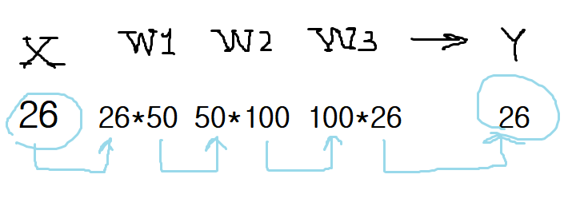

# Monorial
Monorial(모노리얼) is an AI for the [Coda](https://en.wikipedia.org/wiki/Coda_(board_game))  game.

Coda is usually known as Da Vinci Code(다빈치 코드).

## Gameplay of Coda

- https://en.wikipedia.org/wiki/Coda_(board_game)
- https://namu.wiki/w/%EB%8B%A4%EB%B9%88%EC%B9%98%20%EC%BD%94%EB%93%9C(%EB%B3%B4%EB%93%9C%20%EA%B2%8C%EC%9E%84)

## Implementation

### Basic concept of idea
Machine Learning needs...

- data
- output
- target function
- algorithm to minimize loss

On our application...

- data : AI가 알고 있는, 현재 게임판의 타일 상태
- output : 상대의 타일 하나를 reasoning한 결과
- target function : 현제 게임판의 타일 상태를 입력으로 하고, 상대의 타일 하나를 예측해서 가져온다.
- algorithm to minimize loss : 상대의 타일 하나를 맞추는 데 성공했는가?

장기적으로 게임을 바라보고 bluffing 등의 전략을 하는 경우도 있지만 이는 생각하지 않는다.

### Things to consider

- 조커가 들어온 경우 이를 어디에 place할지도 AI가 직접 정해야 함
- 어떤 타일을 reasoning하는 것이 가장 유리할지 선택해야 함

### End-to-end machine learning
조커 place 문제만 나중에 살펴보고, 일단 기본적으로 end-to-end machine learning(사람의 개입 없이 출력을 얻음)으로 하고 프로그램 두 대를 서로 dual시키며 플레이하는 방식으로 이들을 학습시킬 데이터를 얻기로 함 

따라서 개발 순서는...

1. neural network (초기 가중치는 랜덤으로 적절히 조절)
2. input data, get output
3. output과 answer(상대의 타일)를 비교, get loss
4. 기울기 구해 갱신
5. 1~4를 자동화시켜서 서로 플레이하며 배우는 방식으로 자동화
6. profit!!! (과연 여기까지 올 수 있을까)
7. 만약 되면 GUI(웹서버 열던가)

몰라... 일단 다 야매로 시작하는 거야!

## Development

### 딥러닝 특)
무식한 본인 기준이다.

1. 개요 부분만 보면 뭔 내용일지 알 것 같은데 정작 몇 페이지 더 가면 생전 듣도 보다 못한 수식이며 기호가 등장
2. 이렇게 활용해야 할지 감이 안 잡힘

### 야매로 AI 코딩하기
```Python
#!/usr/bin/env python
# -*- coding: utf-8 -*-
```
일단 무작정 `app.py` 파일을 만들었다.
```Python
# 1. neural network (초기 가중치는 랜덤으로 적절히 조절)
# 2. input data, get output
# 3. output과 answer(상대의 타일)를 비교, get loss
# 4. 기울기 구해 갱신
# 5. 1~4를 자동화시켜서 서로 플레이하며 배우는 방식으로 자동화
# 6. profit!!! (과연 여기까지 올 수 있을까)
# 7. 만약 되면 GUI(웹서버 열던가)
```
위에서 생각했던 개발 순서를 주석으로 달아두었다.

가만히 생각해보니 1번 단계부터 구현하기 매우 어렵네...

<밑바닥부터 시작하는 딥러닝>의 예제 코드를 이용하려 했건만 그것도 쉽지 않다.

그냥 꼼수부릴 생각은 버리고 처음부터 읽으면서 직접 짜야겠다.

### 신경망 각 층의 배열 형상



입력은 모든 타일 `(0~11 + 조커)*(흑&백)=13*2=26`, 26개 원소로 구성된 현재 타일 상태이고,

출력 역시 원소 26개로 구성된 1차원 배열이다.

일단은 위 그림과 같이 3층으로 구성된 신경망부터 만들어보자.

입력과 출력의 각 원소는 상태에 따라 아래 세 값 중 하나를 가진다.

- `0(상태를 알 수 없음)`
- `1(AI가 가진 타일)`
- `2(상대방이 가진 타일)`

### 형상을 구현해따
```Python
>>> net = Network(26, [50, 100], 26)
>>> net.params['w1'].shape
(26, 50)
>>> net.params['w2'].shape
(50, 100)
>>> net.params['w3'].shape
(100, 26)
```
이렇게 하면 될 것 가따.

```
w1 shape : (26, 50)
L b1 shape : (50,)
w2 shape : (50, 100)
L b2 shape : (100,)
w3 shape : (100, 26)
L b3 shape : (26,)
```
편향까지 보면 요렇게 나온다.

### 기울기 산출을 하는데...
```Python
>>> from app import *
>>> x = np.random.rand(1, 26)
>>> t = np.random.rand(1, 26)
>>> net = Network(26, [50, 100], 26)
>>> grads = net.numerical_gradient(x, t)
(에러 발생)
PS C:\Users\JunhoYeo\Documents\GitHub\monorial>
```

헉!! 책에 나온 수치 미분 함수를 썼더니 `Python의 작동이 중지되었습니다`라면서 terminated되었다ㅠㅠ

결국 오차역전파법을 써야 하나 보다...

책 예제코드 써서 일단 3층짜리 신경망에 적용해뒀다.

일단 커밋하고 나머지는 학교 컴실에서 해야지

## Reference
- https://namu.wiki/w/%EA%B8%B0%EA%B3%84%ED%95%99%EC%8A%B5
- http://sanghyukchun.github.io/76
- https://github.com/WegraLee/deep-learning-from-scratch